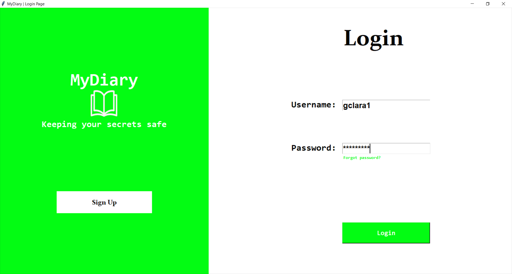
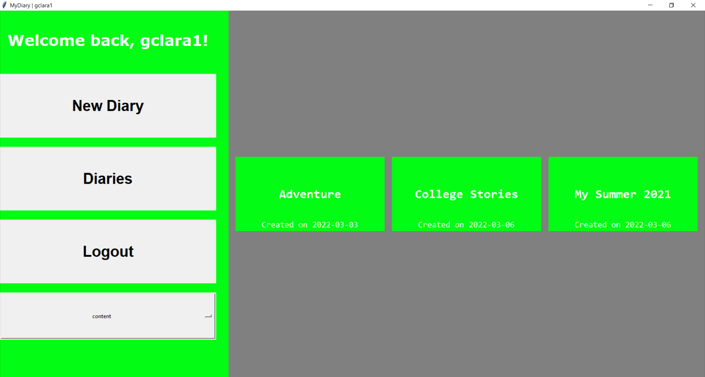
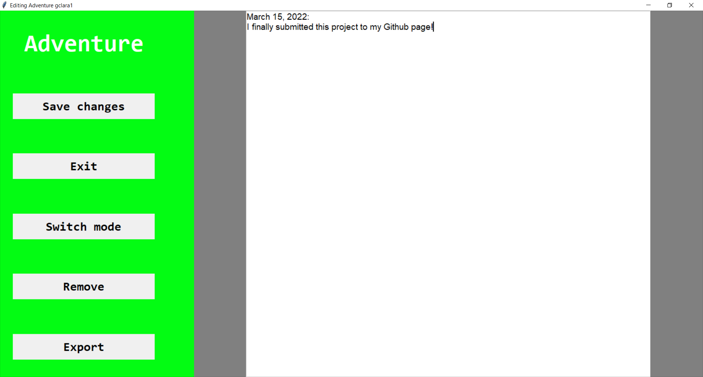

# myDiary
GUI application made with Tkinter that implements a management of digital diaries
## Dependencies
Python3 and Pillow Library
## Features
### 1. Authentication system

### 2. Database storage

### 4. Diaries editor

